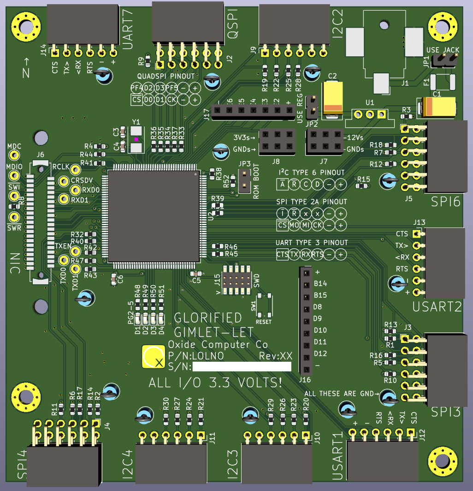
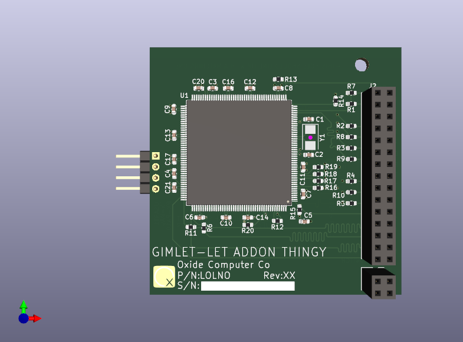
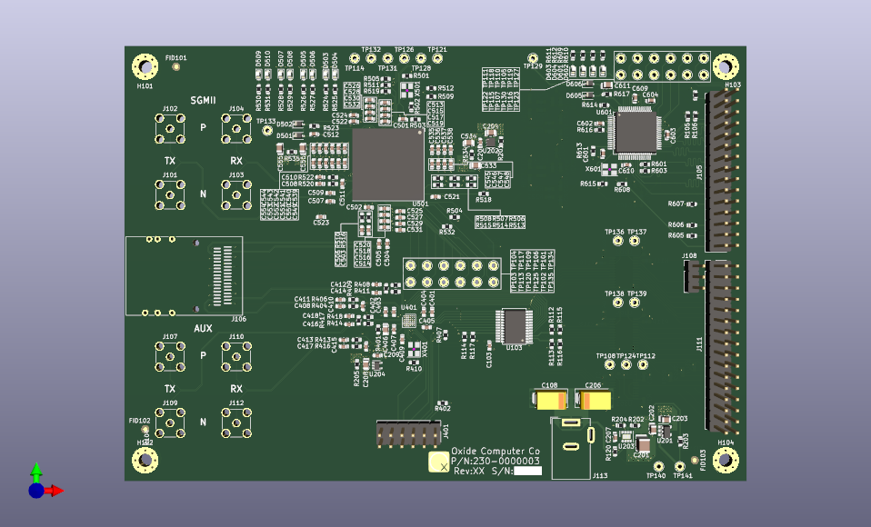

# hw-gimletlet
More full-featured breakout board for the STM32H7, including many expansion headers for daughter boards. 

In active use for Hubris development and as a Swiss Army Knife around the lab.  Generally
when someone is speaking about a "gimletlet" the mean gimletlet2 "Glorified Gimletlet" as
a *vanishingly* small number of gimletlet1's were built and used for some very early network
bring-up.

Some [design notes](docs/gimletlet-2.mkdn) for gimletlet2

Some [mechanical specs](docs/gimletlet-mechanical.pdf)

# Bonus boards

## gimletlet-1
 The OG gimletlet.  Same CPU, nothing else is the same :)

*very limited use, very limited quantity*

[Subfolder](gimletlet1)

Some [design notes](docs/gimletlet.mkdn) for gimletlet1

## management network bringup

*very limited use, very limited quantity*

Pairs with the gimletlet-1

